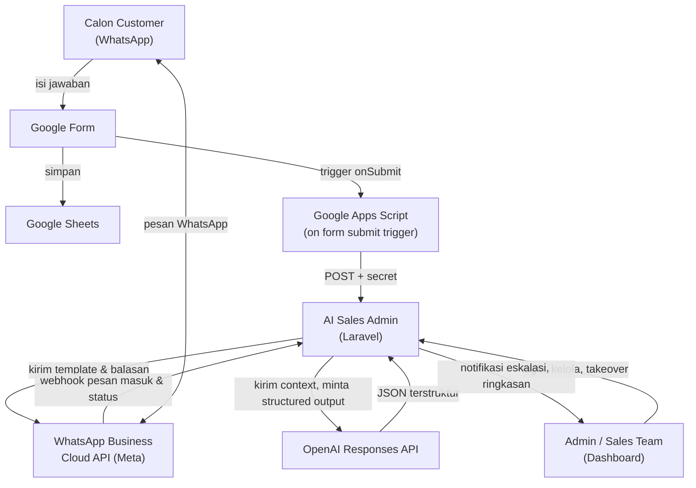
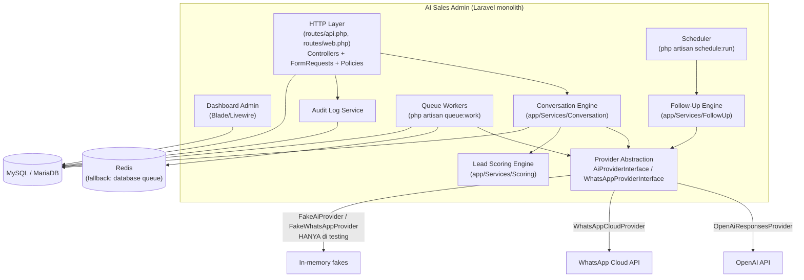
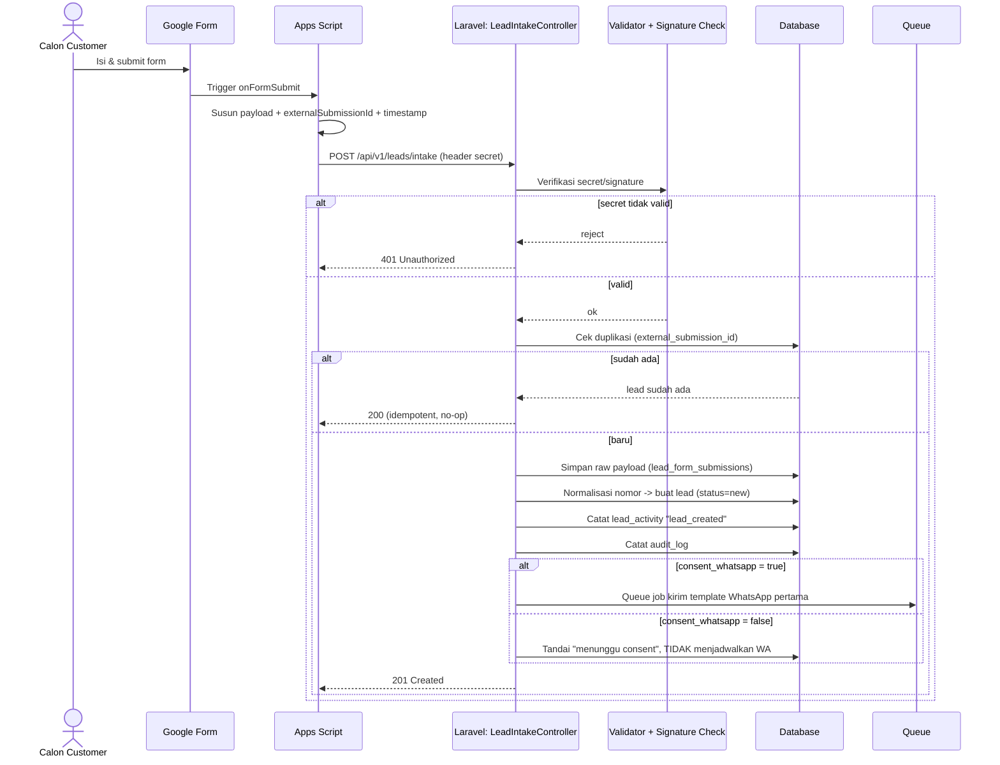
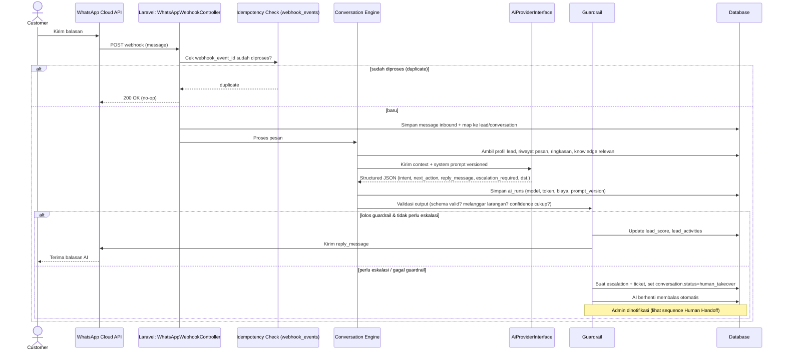
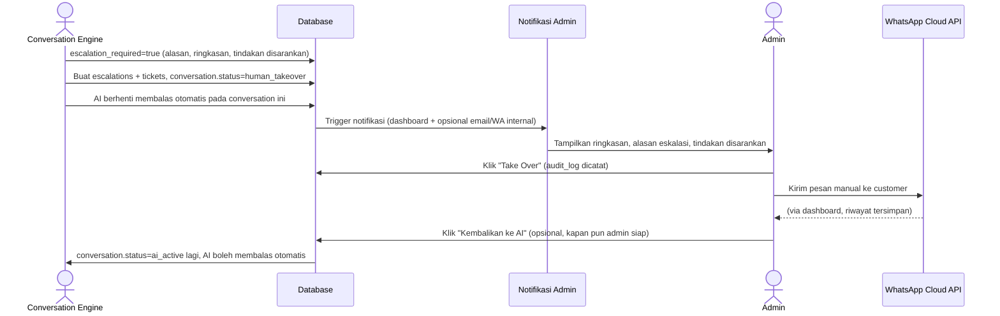
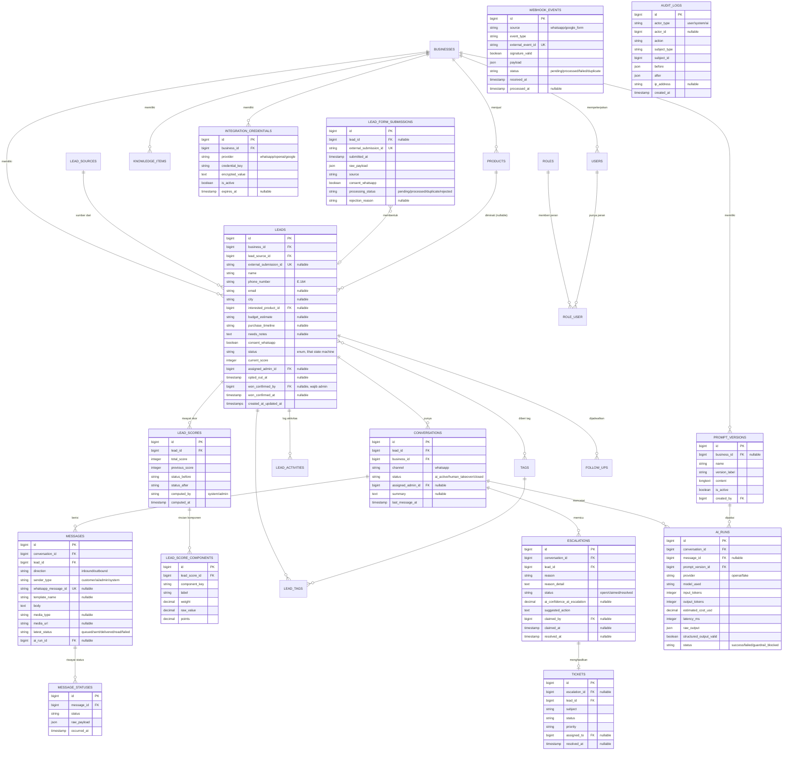
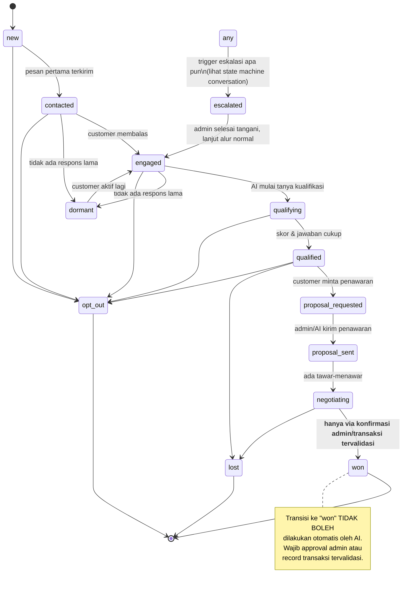
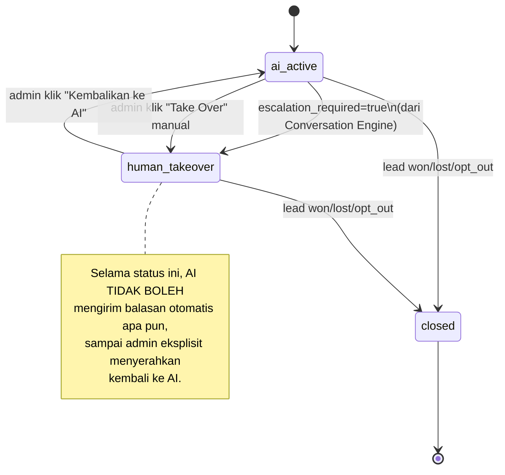

# AI Sales Admin — Arsitektur & Spesifikasi (Fase 1)

Status dokumen: **DESIGNED**. Ini adalah kontrak acuan untuk Fase 2 dan seterusnya. Setiap
kali migration/model/endpoint dibuat, ia harus bisa ditelusuri balik ke bagian di dokumen ini.

Lihat `docs/STATUS.md` untuk definisi status implementasi dan status terkini tiap modul.

---

## 1. System Context Diagram

Prinsip kunci: Apps Script **tidak pernah** menyimpan API key WhatsApp/OpenAI — ia hanya
meneruskan payload form ke Laravel dengan secret bersama. Semua kecerdasan dan keputusan
transaksional ada di Laravel, bukan di Apps Script maupun langsung di model AI.

## 2. Container Diagram

Aplikasi tetap **monolith Laravel** untuk MVP (bukan microservices) — modul dipisah secara
logis lewat namespace `app/Services/*` dan `app/Contracts/*`, bukan lewat proses terpisah.
n8n **tidak** dipakai di MVP, tapi provider abstraction membuatnya bisa disisipkan nanti tanpa
mengubah Conversation Engine.

## 3. Sequence Diagram — Form Submission

## 4. Sequence Diagram — Percakapan WhatsApp

## 5. Sequence Diagram — Human Handoff

## 6. ERD

Tabel yang tidak ditampilkan atributnya di atas (`businesses`, `users`, `roles`, `role_user`,
`lead_sources`, `products`, `knowledge_items`, `follow_ups`, `tags`, `lead_tags`,
`lead_activities`) mengikuti pola kolom standar Laravel (id, timestamps) ditambah field sesuai
namanya sebagaimana dirinci di modul "Business Configuration", "Knowledge Base", "Follow-Up
Engine" pada spesifikasi asli — akan dituliskan lengkap saat migration masing-masing dibuat
(Fase 2, Task #4) supaya tidak dua kali menulis skema yang sama.

## 7. State Machine — Lead

## 8. State Machine — Conversation

## 9. Daftar Environment Variables

| Variable | Wajib di | Keterangan |
|---|---|---|
| `APP_TIMEZONE` | semua | `Asia/Jakarta` (fixed) |
| `APP_LOCALE` | semua | `id` (UI Bahasa Indonesia) |
| `DB_CONNECTION`, `DB_HOST`, `DB_PORT`, `DB_DATABASE`, `DB_USERNAME`, `DB_PASSWORD` | semua | MySQL/MariaDB. Local dev boleh sqlite hanya untuk `.env.testing` |
| `QUEUE_CONNECTION` | semua | `redis` bila tersedia, fallback `database` |
| `REDIS_HOST`, `REDIS_PORT`, `REDIS_PASSWORD` | opsional | Kosongkan jika pakai fallback database queue |
| `LEAD_INTAKE_SECRET` | Fase 2 | Shared secret Apps Script <-> endpoint intake. **Belum dibuat, akan ditambah saat modul Lead Intake dikerjakan.** |
| `WHATSAPP_CLOUD_API_TOKEN` | Fase 3 | Access token Meta. **CREDENTIAL_REQUIRED — belum ada.** |
| `WHATSAPP_PHONE_NUMBER_ID` | Fase 3 | **CREDENTIAL_REQUIRED** |
| `WHATSAPP_BUSINESS_ACCOUNT_ID` | Fase 3 | **CREDENTIAL_REQUIRED** |
| `WHATSAPP_WEBHOOK_VERIFY_TOKEN` | Fase 3 | **CREDENTIAL_REQUIRED** |
| `WHATSAPP_APP_SECRET` | Fase 3 | Untuk verifikasi signature webhook. **CREDENTIAL_REQUIRED** |
| `WHATSAPP_PROVIDER` | Fase 3+ | `fake` (testing) atau `whatsapp_cloud` (production). App **wajib gagal boot** jika `APP_ENV=production` dan value = `fake` |
| `OPENAI_API_KEY` | Fase 4 | **CREDENTIAL_REQUIRED — belum ada** |
| `OPENAI_MODEL_CHEAP`, `OPENAI_MODEL_ADVANCED` | Fase 4 | Untuk model router |
| `AI_PROVIDER` | Fase 4+ | `fake` (testing) atau `openai` (production). App **wajib gagal boot** jika `APP_ENV=production` dan value = `fake` |
| `AI_CONFIDENCE_ESCALATION_THRESHOLD` | Fase 4 | Ambang confidence -> eskalasi otomatis |
| `ESCALATION_TRANSACTION_VALUE_LIMIT` | Fase 4 | Nilai transaksi di atas ini wajib eskalasi |

Env var Fase 3/4 di atas **belum ditambahkan ke `.env.example`** — akan ditambah tepat saat
modul terkait mulai dikerjakan, supaya `.env.example` selalu mencerminkan apa yang benar-benar
sudah aktif, bukan daftar aspirasional.

## 10. Daftar Risiko

1. **Sandbox eksekusi Claude tidak punya akses Packagist/GitHub/root.** Mitigasi: alur kerja
   local-bootstrap + GitHub Actions CI (lihat `docs/STATUS.md`) — sudah berjalan.
2. **PHP lokal Claude hanya bisa 8.1 (tidak dipakai lagi setelah keputusan pivot ke CI).**
   Tidak berdampak karena eksekusi nyata sekarang di komputer user (PHP 8.2.4) dan CI (PHP 8.2).
3. **Kredensial WhatsApp/OpenAI/Google belum ada** — modul terkait berstatus
   `CREDENTIAL_REQUIRED` sampai tersedia; tidak memblokir Fase 0-2.
4. **Idempotency webhook** — WhatsApp dan provider lain umum mengirim webhook duplikat/retry.
   Wajib unique constraint di `webhook_events.external_event_id` sebelum diproses.
5. **Normalisasi nomor Indonesia** — banyak format input (`08xx`, `+628xx`, `628xx`, spasi/strip).
   Wajib normalizer terpusat + test kasus-kasus umum sebelum dipakai di WhatsApp API.
6. **Biaya OpenAI tak terkendali** — mitigasi lewat model router (model hemat utk rutin) +
   pencatatan token/biaya per `ai_runs` + limit di guardrail.
7. **AI mengubah status "won" secara otomatis** — dicegah di level aplikasi (bukan cuma prompt):
   endpoint ubah status ke `won` wajib melalui aksi admin eksplisit, model hanya boleh
   merekomendasikan.
8. **Multi-bisnis di masa depan** — MVP pakai satu `business_id` aktif, tapi semua tabel inti
   sudah memiliki `business_id` FK sejak awal supaya migrasi ke multi-tenant tidak perlu
   migration ulang skema besar-besaran.
9. **Fake provider bocor ke production** — wajib guard di `AppServiceProvider`/config yang
   melempar exception saat boot jika `APP_ENV=production` tapi provider yang dikonfigurasi
   `fake`.

## 11. Acceptance Criteria

**Fase 1 (dokumen ini) dianggap selesai bila:**
- Semua diagram di atas merepresentasikan 15 poin alur MVP di spesifikasi asli tanpa langkah
  yang hilang.
- ERD mencakup seluruh 24 tabel yang diwajibkan, tidak lebih tidak kurang, dengan relasi jelas.
- State machine lead melarang transisi otomatis ke `won` oleh AI (tervalidasi di desain, akan
  ditegakkan lagi di level policy/service saat Fase 2/6).

**Fase 2 (fondasi inti) dianggap selesai bila, dibuktikan lewat CI hijau (bukan klaim):**
- Migration seluruh tabel inti berjalan bersih dari kosong (`migrate:fresh`) di MySQL (CI) dan
  SQLite (lokal).
- Login admin + role-based authorization berfungsi, dibuktikan test authorization (positif &
  negatif).
- Endpoint Lead Intake: submission valid membuat lead; submission duplikat tidak membuat lead
  kedua; nomor invalid ditolak dengan pesan jelas; consent=false tidak menjadwalkan pengiriman
  WhatsApp apa pun.
- Setiap perubahan status lead & submission form menghasilkan baris `audit_logs`.
- Business Configuration bisa dibaca/ditulis admin dan divalidasi.
- `php artisan test` dan `vendor/bin/pint --test` hijau di GitHub Actions.
